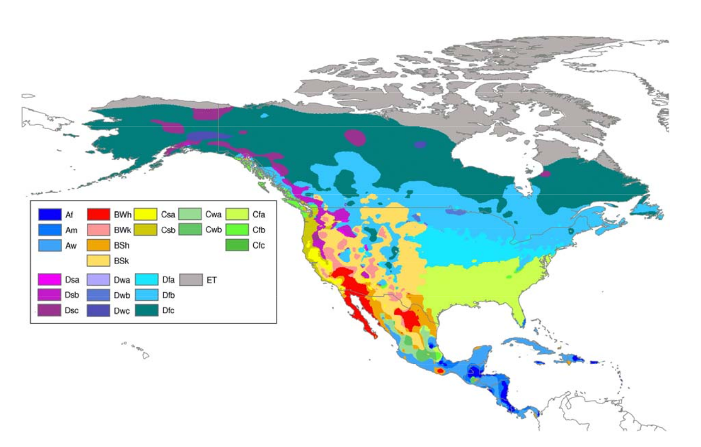
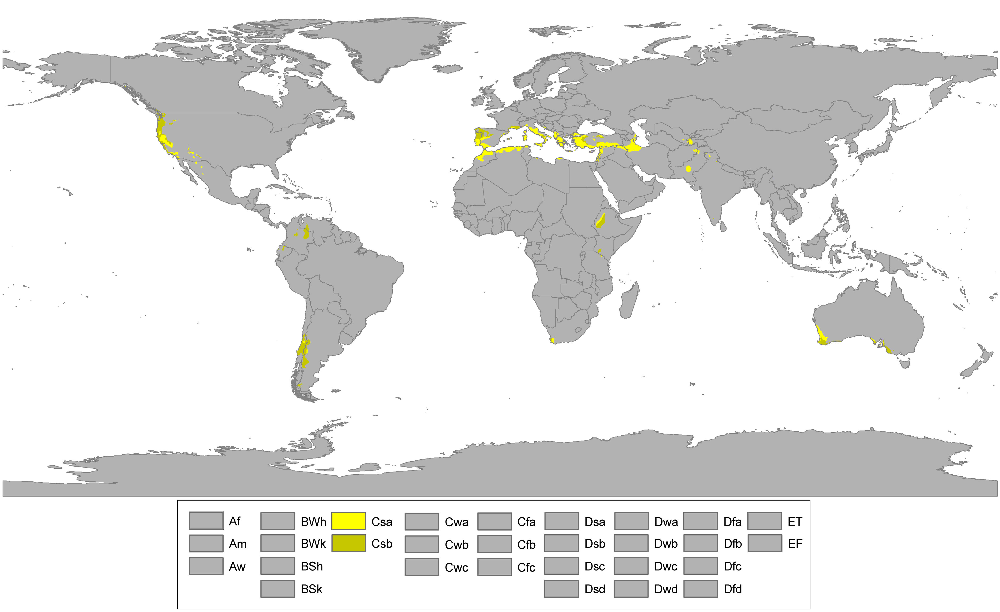
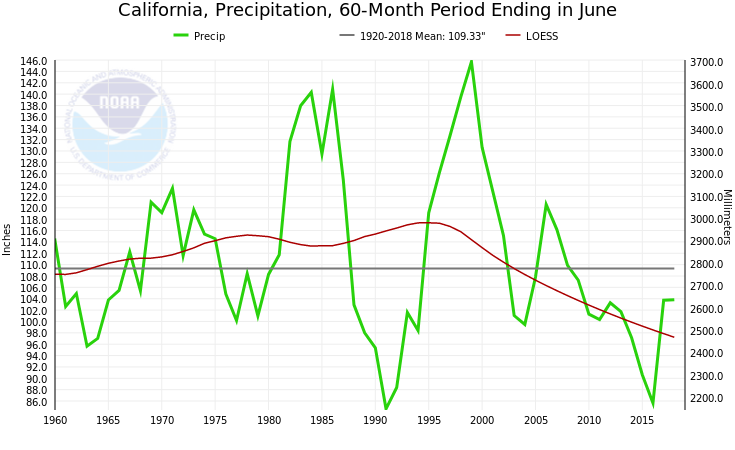

```{r setup, include=FALSE}
knitr::opts_chunk$set(echo = FALSE)
library(readr)
library(tidyverse)
library(lubridate)
```

## Problem outline

> 1. Water sparsity
> 2. Search
> 3. Organic farming
>     - Change in water consumption pattern
>     - "Absolution"
> 4. Continued drought?
> 5. Search continues?

## Overview

1. Problem outline
2. Water and agriculture
3. The 2011-17 California drought
4. Organic farming
5. Viticulture

## 2. Water and agriculture

Rosegrant et al. (2009)

- 70% of global water withdrawals for agriculture
- 15%-35% nonsustainable groundwater withdrawals
- Other issues:
    - water pollution
    - climate change

## 3. The California drought

{width=80%}

---

{width=90%}

---

### Agriculture I 

(Cooley et al. 2015)

- Supplying 1/10 of US agricultural production (by value)
- Biggest agricultural exporter
- Absolute monopoly (in NA) on Olives, Walnuts, Artichokes, Dates etc.

---

### Agriculture II

> - Major contributor to US food self-sufficiency
>     - Potentially contributing to resilience
> - Far cry from progressive food system, e.g.
>     - Local food system (Martinez et al. 2010)
>     - Circular economy (Jurgilevich 2016)
>     - Food justice (Cadieux & Slocum 2015)

---

### Precipitation

{width=80%}
https://www.ncdc.noaa.gov/cag/statewide/time-series/4/pcp/60/6/1960-2019?base_prd=true&firstbaseyear=1920&lastbaseyear=2019&filter=true&filterType=loess

## Water use{.smaller}

```{r water_use, message = FALSE, echo = TRUE, fig.height=3, fig.width=8}
cali_water <- read_csv("../data/cali_water.csv")
ylab <- c(7.5, 10, 12.5, 15, 17.5)
cali_water %>%
  group_by(Reporting_Month) %>%
  summarize(water_production = sum(Production_Reported)) %>%
  ggplot(aes(x=Reporting_Month, y=water_production)) +
  geom_line() +
  labs(x=element_blank(), y="Water production (in billion gallons)") +
  scale_y_continuous(labels = paste0(ylab, "B"), breaks = 10^9 * ylab)
```

## 4. Organic farming

> - Drought and organic farming are independent phenomena
> - Drought could boost organic farming
> - Prohibits use of synthetic fertilizers and pestizides
> - No rules regarding water use
> - Could protect water sources through less pollution, soil protection
> - Could lead to system-wide increase of water consumption, bc lower yield per acre

## Disclaimer on (quantified) water consumption

> - Water can be extracted at any point, not all is measured
> - Water consumption =/= water consumption
>     - Grey water
>     - Polluted water
>     - Soil quality matters (water retention/evaporation)
> - Different water sources

## 5. Viticulture

> - Producer more prominent
> - Easy to match organic label with locality
> - Scale (number) in California lends itself to quantitative analysis

## Data

> - Name, location, date of:
>     - 4,032 vineyards/wineries
>     - 278 USDA certified vineyards/wineries
>     - 60 biodynamic vineyards/wineries
>     - 33 sustainable vineyards/wineries (LODI rules)
> - Circumference of "American Viticultural Areas"
> - Maps
> - Water production for California (subdivisions)
> - A pool of institutional knowledge from qualitative fieldwork (CA & CA)

---

https://julianbarg.shinyapps.io/wine_illustration/

## Outlook

> - Organic farming can address some environmental concerns - but there is no reason to believe it can address all concerns (Shennan et al. 2017)
> - If food suppy is threatened - how would organic farming be affected?


## Data sources:

California water data: 

  - https://data.ca.gov/dataset/drinking-water-public-water-system-operations-monthly-water-production-and-conservation

Vineyards/wineries: 

  - https://github.com/julianbarg/wine_spider 
  - https://github.com/julianbarg/wine_research

## References:

- Cadieux, K. V., Slocum, R., & Cadieux, K. V. (2015). What does it mean to do food justice? What does it mean to do food justice? Journal of Political Ecology, 22, 1–26. Retrieved from http://digitalcommons.hamline.edu/cla_faculty
- Cooley, H., Donnelly, K., Phurisamban, R., & Subramanian, M. (2015). Impacts of California’s ongoing Drought: Agriculture.
- Jurgilevich, A., Birge, T., Kentala-Lehtonen, J., Korhonen-Kurki, K., Pietikäinen, J., Saikku, L., & Schösler, H. (2016). Transition towards circular economy in the food system. Sustainability (Switzerland), 8(1), 1–14. https://doi.org/10.3390/su8010069
- Martinez, S., Hand, M., Pra, M. Da, Pollack, S., Ralston, K., Smith, T., … Newman, C. (2010). Local Food Systems: Concepts, Impacts, and Issues. Err 97, (97), 80.
- Peel, M. C., Finlayson, B. L., & McMahon, T. A. (2007). Updated world map of the Köppen-Geiger climate classification. Hydrology and Earth System Sciences, 11(5), 1633–1644. https://doi.org/10.5194/hess-11-1633-2007
- Rosegrant, M. W., Ringler, C., & Zhu, T. (2009). Water for Agriculture: Maintaining Food Security under Growing Scarcity. Annual Review of Environment and Resources, 34(1), 205–222. https://doi.org/10.1146/annurev.environ.030308.090351
- Shennan, C., Krupnik, T. J., Baird, G., Cohen, H., Forbush, K., Lovell, R. J., & Olimpi, E. M. (2017). Organic and Conventional Agriculture: A Useful Framing? Annual Review of Environment and Resources, 42(1), 317–346. https://doi.org/10.1146/annurev-environ-110615-085750
